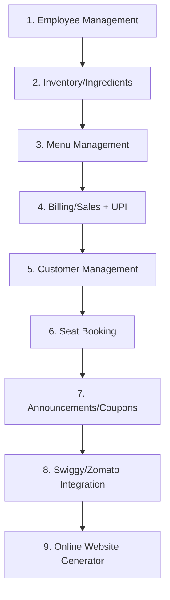

# FoodPaaji - Revised Technical Architecture (Tauri-Based)
*Self-Contained Restaurant Management System with Minimal Dependencies*

## Executive Summary

This revised architecture leverages **Tauri v2** to create a self-contained, offline-first restaurant management system with minimal external dependencies. The application can run as a desktop app, be deployed on a single VM, and provides all the functionality of cloud-based solutions without ongoing external service costs.

## 1. Core Architecture Philosophy

### 1.1 Design Principles
- **Self-Contained**: No external cloud dependencies (AWS, etc.)
- **Offline-First**: Primary functionality works without internet
- **Modular**: Each feature module can be developed independently
- **Cross-Platform**: Desktop apps for Windows, macOS, Linux
- **VM-Deployable**: Single VM can serve multiple restaurants
- **Minimal Footprint**: 10-15MB app size vs 100MB+ alternatives

### 1.2 Technology Stack Revision

```typescript
// Core Framework
Framework: Tauri v2           // Rust backend + React frontend
Frontend: React 18/19         // No Next.js needed for desktop
Styling: Tailwind CSS v4      // Consistent with original plan
UI: shadcn/ui + Aceternity    // Modern component library
State: Zustand + React Query  // Client state + server state
Icons: Lucide React           // Primary icon library

// Backend (Rust)
Database: SQLite + SQLx       // Embedded database, no server
File Storage: Native FS       // Local file system, no S3
Cache: In-memory + SQLite     // No Redis needed
Auth: JWT + Local Storage     // No external auth service
Payments: Local UPI QR Gen    // No payment gateway dependency

// Development
Language: TypeScript + Rust   // Type safety across stack
Testing: Vitest + Cargo Test  // Fast testing for both sides
Build: Tauri CLI              // Unified build system
Package: Native Installers    // MSI, DMG, AppImage
```

## 2. Application Architecture

### 2.1 High-Level Structure

```
┌─────────────────────────────────────────────────────────┐
│                 FoodPaaji Desktop App                   │
├─────────────────────────────────────────────────────────┤
│  Frontend (React + TypeScript)                         │
│  ┌─────────────┬─────────────┬─────────────────────────┐│
│  │ Employee    │ Inventory   │ Menu Management         ││
│  │ Management  │ Management  │                         ││
│  ├─────────────┼─────────────┼─────────────────────────┤│
│  │ Seat        │ Billing/    │ Announcements/         ││
│  │ Booking     │ Sales + UPI │ Coupons/Rewards        ││
│  ├─────────────┼─────────────┼─────────────────────────┤│
│  │ Customer    │ Swiggy/     │ Online Website         ││
│  │ Management  │ Zomato      │ Generator              ││
│  └─────────────┴─────────────┴─────────────────────────┘│
├─────────────────────────────────────────────────────────┤
│               Tauri IPC Layer                           │
├─────────────────────────────────────────────────────────┤
│  Backend (Rust)                                         │
│  ┌─────────────────────────────────────────────────────┐│
│  │ Business Logic Modules                              ││
│  │ • Employee Commands    • Billing Engine             ││
│  │ • Inventory Commands   • UPI QR Generator           ││
│  │ • Menu Commands        • Integration APIs           ││
│  └─────────────────────────────────────────────────────┘│
├─────────────────────────────────────────────────────────┤
│  Local Data Layer                                       │
│  ┌──────────────┬──────────────┬───────────────────────┐│
│  │ SQLite       │ File System  │ Local Config          ││
│  │ Database     │ Storage      │ Store                 ││
│  │              │              │                       ││
│  │ • Orders     │ • Menu Images│ • App Settings        ││
│  │ • Inventory  │ • Reports    │ • User Preferences    ││
│  │ • Customers  │ • Receipts   │ • Integration Keys    ││
│  └──────────────┴──────────────┴───────────────────────┘│
└─────────────────────────────────────────────────────────┘
```

### 2.2 Project Structure

```
foodpaaji/
├── src/                          # React frontend
│   ├── components/
│   │   ├── ui/                   # shadcn/ui components
│   │   ├── modules/              # Feature-specific components
│   │   │   ├── employee/
│   │   │   ├── inventory/
│   │   │   ├── menu/
│   │   │   ├── booking/
│   │   │   ├── billing/
│   │   │   ├── announcements/
│   │   │   ├── customers/
│   │   │   ├── integrations/
│   │   │   └── website/
│   │   └── layout/
│   ├── hooks/                    # Custom React hooks
│   ├── stores/                   # Zustand stores
│   ├── lib/                      # Utilities
│   └── types/                    # TypeScript types
├── src-tauri/                    # Rust backend
│   ├── src/
│   │   ├── modules/              # Business logic modules
│   │   │   ├── employee.rs
│   │   │   ├── inventory.rs
│   │   │   ├── menu.rs
│   │   │   ├── booking.rs
│   │   │   ├── billing.rs
│   │   │   ├── announcements.rs
│   │   │   ├── customers.rs
│   │   │   ├── integrations.rs
│   │   │   └── website.rs
│   │   ├── database/             # SQLite operations
│   │   ├── services/             # Business services
│   │   ├── utils/                # Helper functions
│   │   ├── main.rs               # Application entry
│   │   └── lib.rs                # Module exports
│   ├── migrations/               # Database migrations
│   ├── Cargo.toml               # Rust dependencies
│   └── tauri.conf.json          # Tauri configuration
├── public/                      # Static assets
├── package.json                 # Frontend dependencies
└── README.md
```

## 3. Modular Feature Development

### 3.1 Feature Development Order



### 3.2 Module Implementation Pattern

Each feature follows this consistent pattern:

#### Frontend Module Structure
```typescript
// src/components/modules/employee/
├── components/
│   ├── EmployeeList.tsx
│   ├── EmployeeForm.tsx
│   ├── EmployeeCard.tsx
│   └── EmployeeSearch.tsx
├── hooks/
│   ├── useEmployees.ts
│   └── useEmployeeForm.ts
├── stores/
│   └── employeeStore.ts
├── types/
│   └── employee.types.ts
└── index.ts                     # Export barrel
```

#### Rust Backend Module
```rust
// src-tauri/src/modules/employee.rs
use serde::{Deserialize, Serialize};
use sqlx::{Row, SqlitePool};
use tauri::State;

#[derive(Debug, Serialize, Deserialize)]
pub struct Employee {
    pub id: Option<i64>,
    pub first_name: String,
    pub last_name: String,
    pub email: String,
    pub phone: String,
    pub role: String,
    pub salary: f64,
    pub hire_date: String,
    pub is_active: bool,
}

#[tauri::command]
pub async fn create_employee(
    employee: Employee,
    db: State<'_, SqlitePool>,
) -> Result<Employee, String> {
    // Implementation
}

#[tauri::command]
pub async fn get_employees(
    db: State<'_, SqlitePool>,
) -> Result<Vec<Employee>, String> {
    // Implementation
}

#[tauri::command]
pub async fn update_employee(
    employee: Employee,
    db: State<'_, SqlitePool>,
) -> Result<Employee, String> {
    // Implementation
}

#[tauri::command]
pub async fn delete_employee(
    id: i64,
    db: State<'_, SqlitePool>,
) -> Result<(), String> {
    // Implementation
}
```

## 4. Self-Contained Database Design

### 4.1 SQLite Schema Implementation

```sql
-- Core Tables for Self-Contained System
-- migrations/001_initial.sql

-- Restaurants (Multi-tenant support)
CREATE TABLE restaurants (
    id INTEGER PRIMARY KEY AUTOINCREMENT,
    name TEXT NOT NULL,
    slug TEXT UNIQUE NOT NULL,
    email TEXT UNIQUE NOT NULL,
    phone TEXT NOT NULL,
    address TEXT NOT NULL, -- JSON string
    settings TEXT DEFAULT '{}', -- JSON string
    subscription_tier TEXT DEFAULT 'STARTER',
    is_active BOOLEAN DEFAULT 1,
    created_at DATETIME DEFAULT CURRENT_TIMESTAMP,
    updated_at DATETIME DEFAULT CURRENT_TIMESTAMP
);

-- Users/Employees
CREATE TABLE users (
    id INTEGER PRIMARY KEY AUTOINCREMENT,
    restaurant_id INTEGER NOT NULL,
    email TEXT UNIQUE NOT NULL,
    phone TEXT UNIQUE,
    password_hash TEXT NOT NULL,
    first_name TEXT NOT NULL,
    last_name TEXT NOT NULL,
    role TEXT NOT NULL DEFAULT 'CASHIER',
    permissions TEXT DEFAULT '[]', -- JSON array
    salary DECIMAL(10,2),
    hire_date DATE,
    is_active BOOLEAN DEFAULT 1,
    last_login DATETIME,
    created_at DATETIME DEFAULT CURRENT_TIMESTAMP,
    updated_at DATETIME DEFAULT CURRENT_TIMESTAMP,
    FOREIGN KEY (restaurant_id) REFERENCES restaurants (id)
);

-- Inventory Items
CREATE TABLE inventory_items (
    id INTEGER PRIMARY KEY AUTOINCREMENT,
    restaurant_id INTEGER NOT NULL,
    name TEXT NOT NULL,
    name_hi TEXT, -- Hindi translation
    name_bn TEXT, -- Bengali translation
    category TEXT NOT NULL,
    unit TEXT NOT NULL, -- KG, GRAM, LITER, etc.
    current_stock DECIMAL(10,3) NOT NULL DEFAULT 0,
    min_stock_level DECIMAL(10,3) NOT NULL DEFAULT 0,
    max_stock_level DECIMAL(10,3),
    cost_per_unit DECIMAL(10,2) NOT NULL,
    supplier TEXT,
    expiry_date DATE,
    location TEXT,
    barcode TEXT,
    created_at DATETIME DEFAULT CURRENT_TIMESTAMP,
    updated_at DATETIME DEFAULT CURRENT_TIMESTAMP,
    FOREIGN KEY (restaurant_id) REFERENCES restaurants (id),
    UNIQUE(restaurant_id, name)
);

-- Menu Categories
CREATE TABLE menu_categories (
    id INTEGER PRIMARY KEY AUTOINCREMENT,
    restaurant_id INTEGER NOT NULL,
    name TEXT NOT NULL,
    name_hi TEXT,
    name_bn TEXT,
    description TEXT,
    sort_order INTEGER DEFAULT 0,
    is_active BOOLEAN DEFAULT 1,
    image_path TEXT, -- Local file path
    created_at DATETIME DEFAULT CURRENT_TIMESTAMP,
    updated_at DATETIME DEFAULT CURRENT_TIMESTAMP,
    FOREIGN KEY (restaurant_id) REFERENCES restaurants (id),
    UNIQUE(restaurant_id, name)
);

-- Menu Items
CREATE TABLE menu_items (
    id INTEGER PRIMARY KEY AUTOINCREMENT,
    restaurant_id INTEGER NOT NULL,
    category_id INTEGER NOT NULL,
    name TEXT NOT NULL,
    name_hi TEXT,
    name_bn TEXT,
    description TEXT,
    price DECIMAL(10,2) NOT NULL,
    cost_price DECIMAL(10,2),
    is_vegetarian BOOLEAN DEFAULT 0,
    is_vegan BOOLEAN DEFAULT 0,
    is_gluten_free BOOLEAN DEFAULT 0,
    is_spicy BOOLEAN DEFAULT 0,
    spice_level INTEGER DEFAULT 0,
    preparation_time INTEGER, -- minutes
    calories INTEGER,
    is_available BOOLEAN DEFAULT 1,
    image_path TEXT, -- Local file path
    tags TEXT DEFAULT '[]', -- JSON array
    allergens TEXT DEFAULT '[]', -- JSON array
    
    -- External integration fields
    external_id TEXT, -- Swiggy/Zomato ID
    source TEXT, -- SWIGGY, ZOMATO, INTERNAL
    
    sort_order INTEGER DEFAULT 0,
    created_at DATETIME DEFAULT CURRENT_TIMESTAMP,
    updated_at DATETIME DEFAULT CURRENT_TIMESTAMP,
    FOREIGN KEY (restaurant_id) REFERENCES restaurants (id),
    FOREIGN KEY (category_id) REFERENCES menu_categories (id),
    UNIQUE(restaurant_id, external_id, source)
);

-- Tables/Seats
CREATE TABLE tables (
    id INTEGER PRIMARY KEY AUTOINCREMENT,
    restaurant_id INTEGER NOT NULL,
    number TEXT NOT NULL,
    name TEXT,
    capacity INTEGER NOT NULL DEFAULT 4,
    location TEXT, -- Indoor, Outdoor, etc.
    is_active BOOLEAN DEFAULT 1,
    qr_code_path TEXT, -- Path to QR code image
    created_at DATETIME DEFAULT CURRENT_TIMESTAMP,
    FOREIGN KEY (restaurant_id) REFERENCES restaurants (id),
    UNIQUE(restaurant_id, number)
);

-- Table Reservations
CREATE TABLE table_reservations (
    id INTEGER PRIMARY KEY AUTOINCREMENT,
    restaurant_id INTEGER NOT NULL,
    table_id INTEGER NOT NULL,
    customer_name TEXT NOT NULL,
    customer_phone TEXT NOT NULL,
    customer_email TEXT,
    party_size INTEGER NOT NULL,
    reservation_date DATE NOT NULL,
    reservation_time TIME NOT NULL,
    duration_minutes INTEGER DEFAULT 120,
    special_requests TEXT,
    status TEXT DEFAULT 'PENDING', -- PENDING, CONFIRMED, CANCELLED, COMPLETED
    created_at DATETIME DEFAULT CURRENT_TIMESTAMP,
    FOREIGN KEY (restaurant_id) REFERENCES restaurants (id),
    FOREIGN KEY (table_id) REFERENCES tables (id)
);

-- Orders
CREATE TABLE orders (
    id INTEGER PRIMARY KEY AUTOINCREMENT,
    restaurant_id INTEGER NOT NULL,
    order_number TEXT UNIQUE NOT NULL,
    type TEXT NOT NULL, -- DINE_IN, TAKEAWAY, DELIVERY
    status TEXT NOT NULL DEFAULT 'PENDING',
    source TEXT DEFAULT 'INTERNAL', -- INTERNAL, SWIGGY, ZOMATO, WHATSAPP
    external_id TEXT, -- External order ID
    
    -- Customer info
    customer_name TEXT,
    customer_phone TEXT,
    customer_email TEXT,
    
    -- Table info (for dine-in)
    table_id INTEGER,
    
    -- Delivery info (for delivery orders)
    delivery_address TEXT, -- JSON string
    delivery_fee DECIMAL(8,2) DEFAULT 0,
    delivery_time DATETIME,
    
    -- Pricing
    subtotal DECIMAL(10,2) NOT NULL,
    tax_amount DECIMAL(10,2) NOT NULL DEFAULT 0,
    service_charge DECIMAL(10,2) DEFAULT 0,
    packaging_charge DECIMAL(10,2) DEFAULT 0,
    discount_amount DECIMAL(10,2) DEFAULT 0,
    total_amount DECIMAL(10,2) NOT NULL,
    
    -- Timestamps
    placed_at DATETIME DEFAULT CURRENT_TIMESTAMP,
    confirmed_at DATETIME,
    preparing_at DATETIME,
    ready_at DATETIME,
    completed_at DATETIME,
    cancelled_at DATETIME,
    
    special_instructions TEXT,
    created_by INTEGER NOT NULL, -- User ID
    created_at DATETIME DEFAULT CURRENT_TIMESTAMP,
    updated_at DATETIME DEFAULT CURRENT_TIMESTAMP,
    
    FOREIGN KEY (restaurant_id) REFERENCES restaurants (id),
    FOREIGN KEY (table_id) REFERENCES tables (id),
    FOREIGN KEY (created_by) REFERENCES users (id)
);

-- Order Items
CREATE TABLE order_items (
    id INTEGER PRIMARY KEY AUTOINCREMENT,
    order_id INTEGER NOT NULL,
    menu_item_id INTEGER NOT NULL,
    quantity INTEGER NOT NULL,
    unit_price DECIMAL(10,2) NOT NULL,
    total_price DECIMAL(10,2) NOT NULL,
    special_instructions TEXT,
    modifiers TEXT DEFAULT '[]', -- JSON array of applied modifiers
    FOREIGN KEY (order_id) REFERENCES orders (id) ON DELETE CASCADE,
    FOREIGN KEY (menu_item_id) REFERENCES menu_items (id)
);

-- Customers
CREATE TABLE customers (
    id INTEGER PRIMARY KEY AUTOINCREMENT,
    restaurant_id INTEGER NOT NULL,
    first_name TEXT NOT NULL,
    last_name TEXT,
    email TEXT,
    phone TEXT NOT NULL,
    date_of_birth DATE,
    anniversary DATE,
    
    -- Address (stored as JSON)
    addresses TEXT DEFAULT '[]',
    
    -- Loyalty
    loyalty_points INTEGER DEFAULT 0,
    total_spent DECIMAL(12,2) DEFAULT 0,
    visit_count INTEGER DEFAULT 0,
    last_visit DATE,
    
    -- Preferences (stored as JSON)
    preferences TEXT DEFAULT '{}',
    
    -- Marketing
    marketing_consent BOOLEAN DEFAULT 0,
    
    created_at DATETIME DEFAULT CURRENT_TIMESTAMP,
    updated_at DATETIME DEFAULT CURRENT_TIMESTAMP,
    
    FOREIGN KEY (restaurant_id) REFERENCES restaurants (id),
    UNIQUE(restaurant_id, phone)
);

-- Bills/Invoices
CREATE TABLE bills (
    id INTEGER PRIMARY KEY AUTOINCREMENT,
    restaurant_id INTEGER NOT NULL,
    order_id INTEGER UNIQUE NOT NULL,
    bill_number TEXT UNIQUE NOT NULL,
    
    -- Tax breakdown (GST)
    subtotal DECIMAL(10,2) NOT NULL,
    cgst_rate DECIMAL(5,2) DEFAULT 0,
    cgst_amount DECIMAL(10,2) DEFAULT 0,
    sgst_rate DECIMAL(5,2) DEFAULT 0,
    sgst_amount DECIMAL(10,2) DEFAULT 0,
    igst_rate DECIMAL(5,2) DEFAULT 0,
    igst_amount DECIMAL(10,2) DEFAULT 0,
    
    service_charge_rate DECIMAL(5,2) DEFAULT 0,
    service_charge DECIMAL(10,2) DEFAULT 0,
    packaging_charge DECIMAL(10,2) DEFAULT 0,
    delivery_charge DECIMAL(10,2) DEFAULT 0,
    discount_amount DECIMAL(10,2) DEFAULT 0,
    
    total_amount DECIMAL(10,2) NOT NULL,
    paid_amount DECIMAL(10,2) DEFAULT 0,
    balance_amount DECIMAL(10,2) DEFAULT 0,
    
    status TEXT DEFAULT 'UNPAID', -- UNPAID, PARTIALLY_PAID, PAID, REFUNDED
    payment_method TEXT, -- CASH, UPI, CARD, etc.
    upi_transaction_id TEXT,
    
    created_at DATETIME DEFAULT CURRENT_TIMESTAMP,
    updated_at DATETIME DEFAULT CURRENT_TIMESTAMP,
    
    FOREIGN KEY (restaurant_id) REFERENCES restaurants (id),
    FOREIGN KEY (order_id) REFERENCES orders (id)
);

-- Announcements/Offers
CREATE TABLE announcements (
    id INTEGER PRIMARY KEY AUTOINCREMENT,
    restaurant_id INTEGER NOT NULL,
    title TEXT NOT NULL,
    description TEXT,
    type TEXT NOT NULL, -- ANNOUNCEMENT, OFFER, COUPON
    
    -- Offer/Coupon specific fields
    discount_type TEXT, -- PERCENTAGE, FIXED_AMOUNT
    discount_value DECIMAL(10,2),
    min_order_amount DECIMAL(10,2),
    max_discount_amount DECIMAL(10,2),
    coupon_code TEXT,
    usage_limit INTEGER,
    usage_count INTEGER DEFAULT 0,
    
    -- Validity
    start_date DATETIME,
    end_date DATETIME,
    is_active BOOLEAN DEFAULT 1,
    
    -- Targeting
    target_customers TEXT DEFAULT '[]', -- JSON array of customer IDs
    applicable_items TEXT DEFAULT '[]', -- JSON array of menu item IDs
    
    created_at DATETIME DEFAULT CURRENT_TIMESTAMP,
    updated_at DATETIME DEFAULT CURRENT_TIMESTAMP,
    
    FOREIGN KEY (restaurant_id) REFERENCES restaurants (id)
);

-- Integration Settings
CREATE TABLE integration_settings (
    id INTEGER PRIMARY KEY AUTOINCREMENT,
    restaurant_id INTEGER NOT NULL,
    platform TEXT NOT NULL, -- SWIGGY, ZOMATO, etc.
    is_enabled BOOLEAN DEFAULT 0,
    api_key TEXT,
    api_secret TEXT,
    webhook_url TEXT,
    settings TEXT DEFAULT '{}', -- JSON configuration
    last_sync DATETIME,
    created_at DATETIME DEFAULT CURRENT_TIMESTAMP,
    updated_at DATETIME DEFAULT CURRENT_TIMESTAMP,
    FOREIGN KEY (restaurant_id) REFERENCES restaurants (id),
    UNIQUE(restaurant_id, platform)
);

-- File Storage Records
CREATE TABLE file_records (
    id INTEGER PRIMARY KEY AUTOINCREMENT,
    restaurant_id INTEGER NOT NULL,
    file_path TEXT NOT NULL,
    original_name TEXT NOT NULL,
    file_type TEXT NOT NULL, -- image/jpeg, application/pdf, etc.
    file_size INTEGER NOT NULL,
    purpose TEXT NOT NULL, -- menu_item, receipt, report, etc.
    reference_id TEXT, -- ID of related entity
    created_at DATETIME DEFAULT CURRENT_TIMESTAMP,
    FOREIGN KEY (restaurant_id) REFERENCES restaurants (id)
);

-- Indexes for Performance
CREATE INDEX idx_orders_restaurant_status ON orders(restaurant_id, status);
CREATE INDEX idx_orders_created_at ON orders(created_at DESC);
CREATE INDEX idx_menu_items_category ON menu_items(category_id, is_available);
CREATE INDEX idx_inventory_stock_level ON inventory_items(restaurant_id, current_stock);
CREATE INDEX idx_customers_phone ON customers(restaurant_id, phone);
CREATE INDEX idx_bills_restaurant_date ON bills(restaurant_id, created_at DESC);
CREATE INDEX idx_reservations_date ON table_reservations(restaurant_id, reservation_date, reservation_time);

-- Full-text search (SQLite FTS5)
CREATE VIRTUAL TABLE menu_items_fts USING fts5(
    menu_item_id UNINDEXED,
    restaurant_id UNINDEXED,
    name,
    description,
    tags
);

CREATE VIRTUAL TABLE customers_fts USING fts5(
    customer_id UNINDEXED,
    restaurant_id UNINDEXED,
    first_name,
    last_name,
    phone,
    email
);
```

## 5. Local File Storage Strategy

### 5.1 File Organization
```
AppData/FoodPaaji/
├── databases/
│   └── restaurant_{id}.db        # SQLite database per restaurant
├── uploads/
│   ├── menu_items/              # Menu item images
│   ├── profiles/                # Staff profile photos
│   ├── receipts/                # Generated receipt PDFs
│   └── reports/                 # Business reports
├── exports/
│   ├── backups/                 # Database backups
│   └── csv/                     # CSV exports
├── config/
│   └── app_settings.json        # Application configuration
└── logs/
    └── application.log          # Application logs
```

### 5.2 File Management Implementation
```rust
// src-tauri/src/services/file_service.rs
use std::fs;
use std::path::{Path, PathBuf};
use tauri::api::path::data_dir;

pub struct FileService {
    base_path: PathBuf,
}

impl FileService {
    pub fn new() -> Result<Self, String> {
        let base_path = data_dir()
            .ok_or("Could not get data directory")?
            .join("FoodPaaji");
            
        // Create required directories
        fs::create_dir_all(&base_path.join("uploads/menu_items"))?;
        fs::create_dir_all(&base_path.join("uploads/receipts"))?;
        fs::create_dir_all(&base_path.join("exports/backups"))?;
        
        Ok(Self { base_path })
    }
    
    pub async fn save_menu_image(
        &self, 
        restaurant_id: i64, 
        item_id: i64, 
        image_data: Vec<u8>
    ) -> Result<String, String> {
        let file_path = self.base_path
            .join("uploads/menu_items")
            .join(format!("{}_{}.jpg", restaurant_id, item_id));
            
        fs::write(&file_path, image_data)
            .map_err(|e| format!("Failed to save image: {}", e))?;
            
        Ok(file_path.to_string_lossy().to_string())
    }
    
    pub async fn generate_backup(&self, restaurant_id: i64) -> Result<String, String> {
        let timestamp = chrono::Utc::now().format("%Y%m%d_%H%M%S");
        let backup_path = self.base_path
            .join("exports/backups")
            .join(format!("backup_{}_{}.db", restaurant_id, timestamp));
            
        let source_db = self.base_path
            .join("databases")
            .join(format!("restaurant_{}.db", restaurant_id));
            
        fs::copy(source_db, &backup_path)
            .map_err(|e| format!("Backup failed: {}", e))?;
            
        Ok(backup_path.to_string_lossy().to_string())
    }
}
```

## 6. UPI QR Code Generation (Local)

### 6.1 Self-Contained UPI Implementation
```rust
// src-tauri/src/services/upi_service.rs
use qrcode::{QrCode, EcLevel};
use image::{ImageBuffer, Rgb};
use serde::{Deserialize, Serialize};

#[derive(Debug, Serialize, Deserialize)]
pub struct UpiQrRequest {
    pub merchant_id: String,    // Merchant UPI ID
    pub merchant_name: String,  // Restaurant name
    pub amount: f64,           // Transaction amount
    pub transaction_ref: String, // Order ID or reference
    pub note: Option<String>,   // Optional note
}

#[derive(Debug, Serialize, Deserialize)]
pub struct UpiQrResponse {
    pub qr_data: String,       // UPI URI
    pub qr_image_base64: String, // Base64 encoded QR image
    pub transaction_ref: String,
}

impl UpiQrRequest {
    pub fn to_upi_uri(&self) -> String {
        let mut uri = format!(
            "upi://pay?pa={}&pn={}&am={:.2}&tr={}",
            self.merchant_id,
            urlencoding::encode(&self.merchant_name),
            self.amount,
            self.transaction_ref
        );
        
        if let Some(note) = &self.note {
            uri.push_str(&format!("&tn={}", urlencoding::encode(note)));
        }
        
        uri
    }
}

#[tauri::command]
pub async fn generate_upi_qr(request: UpiQrRequest) -> Result<UpiQrResponse, String> {
    let upi_uri = request.to_upi_uri();
    
    // Generate QR code
    let code = QrCode::with_error_correction_level(&upi_uri, EcLevel::M)
        .map_err(|e| format!("Failed to generate QR code: {}", e))?;
    
    // Convert to image
    let image = code.render::<Rgb<u8>>()
        .min_dimensions(200, 200)
        .max_dimensions(400, 400)
        .build();
    
    // Convert to base64
    let mut buffer = Vec::new();
    let mut cursor = std::io::Cursor::new(&mut buffer);
    
    image::DynamicImage::ImageRgb8(image)
        .write_to(&mut cursor, image::ImageOutputFormat::Png)
        .map_err(|e| format!("Failed to encode image: {}", e))?;
    
    let base64_image = base64::encode(&buffer);
    
    Ok(UpiQrResponse {
        qr_data: upi_uri,
        qr_image_base64: base64_image,
        transaction_ref: request.transaction_ref,
    })
}

#[tauri::command]
pub async fn validate_upi_payment(
    transaction_ref: String,
    expected_amount: f64,
) -> Result<bool, String> {
    // This would integrate with bank APIs or webhook validation
    // For now, return a mock validation
    // In real implementation, you'd check with your bank's API
    
    // Mock validation logic
    tokio::time::sleep(std::time::Duration::from_secs(2)).await;
    
    // Return success for demonstration
    Ok(true)
}
```

### 6.2 Frontend UPI Integration
```typescript
// src/hooks/useUpiPayment.ts
import { useState } from 'react'
import { invoke } from '@tauri-apps/api/tauri'

interface UpiQrRequest {
  merchant_id: string
  merchant_name: string
  amount: number
  transaction_ref: string
  note?: string
}

interface UpiQrResponse {
  qr_data: string
  qr_image_base64: string
  transaction_ref: string
}

export function useUpiPayment() {
  const [qrCode, setQrCode] = useState<string | null>(null)
  const [isGenerating, setIsGenerating] = useState(false)
  const [isValidating, setIsValidating] = useState(false)

  const generateQrCode = async (request: UpiQrRequest): Promise<UpiQrResponse> => {
    setIsGenerating(true)
    try {
      const response = await invoke<UpiQrResponse>('generate_upi_qr', { request })
      setQrCode(response.qr_image_base64)
      return response
    } finally {
      setIsGenerating(false)
    }
  }

  const validatePayment = async (
    transactionRef: string, 
    expectedAmount: number
  ): Promise<boolean> => {
    setIsValidating(true)
    try {
      return await invoke<boolean>('validate_upi_payment', {
        transactionRef,
        expectedAmount
      })
    } finally {
      setIsValidating(false)
    }
  }

  return {
    qrCode,
    isGenerating,
    isValidating,
    generateQrCode,
    validatePayment
  }
}
```

## 7. Modular Development Implementation

### 7.1 Feature Module: Employee Management

#### Frontend Components
```typescript
// src/components/modules/employee/EmployeeManagement.tsx
import React from 'react'
import { Card, CardContent, CardHeader, CardTitle } from '@/components/ui/card'
import { Button } from '@/components/ui/button'
import { Plus, Users, UserCheck, UserX } from 'lucide-react'
import { EmployeeList } from './EmployeeList'
import { EmployeeForm } from './EmployeeForm'
import { useEmployees } from './hooks/useEmployees'

export function EmployeeManagement() {
  const { 
    employees, 
    isLoading, 
    createEmployee, 
    updateEmployee, 
    deleteEmployee 
  } = useEmployees()

  return (
    <div className="p-6 space-y-6">
      {/* Stats Cards */}
      <div className="grid grid-cols-1 md:grid-cols-4 gap-4">
        <Card>
          <CardHeader className="flex flex-row items-center justify-between space-y-0 pb-2">
            <CardTitle className="text-sm font-medium">Total Employees</CardTitle>
            <Users className="h-4 w-4 text-muted-foreground" />
          </CardHeader>
          <CardContent>
            <div className="text-2xl font-bold">{employees.length}</div>
          </CardContent>
        </Card>
        
        <Card>
          <CardHeader className="flex flex-row items-center justify-between space-y-0 pb-2">
            <CardTitle className="text-sm font-medium">Active</CardTitle>
            <UserCheck className="h-4 w-4 text-green-600" />
          </CardHeader>
          <CardContent>
            <div className="text-2xl font-bold text-green-600">
              {employees.filter(emp => emp.is_active).length}
            </div>
          </CardContent>
        </Card>
        
        <Card>
          <CardHeader className="flex flex-row items-center justify-between space-y-0 pb-2">
            <CardTitle className="text-sm font-medium">Inactive</CardTitle>
            <UserX className="h-4 w-4 text-red-600" />
          </CardHeader>
          <CardContent>
            <div className="text-2xl font-bold text-red-600">
              {employees.filter(emp => !emp.is_active).length}
            </div>
          </CardContent>
        </Card>
      </div>

      {/* Employee Management */}
      <Card>
        <CardHeader>
          <div className="flex justify-between items-center">
            <CardTitle>Employee Management</CardTitle>
            <Button>
              <Plus className="h-4 w-4 mr-2" />
              Add Employee
            </Button>
          </div>
        </CardHeader>
        <CardContent>
          <EmployeeList 
            employees={employees}
            onUpdate={updateEmployee}
            onDelete={deleteEmployee}
          />
        </CardContent>
      </Card>
    </div>
  )
}
```

#### Rust Backend Commands
```rust
// src-tauri/src/modules/employee.rs
use serde::{Deserialize, Serialize};
use sqlx::{Row, SqlitePool};
use tauri::State;
use chrono::{DateTime, Utc};

#[derive(Debug, Serialize, Deserialize, sqlx::FromRow)]
pub struct Employee {
    pub id: Option<i64>,
    pub restaurant_id: i64,
    pub email: String,
    pub phone: Option<String>,
    pub first_name: String,
    pub last_name: String,
    pub role: String,
    pub salary: Option<f64>,
    pub hire_date: Option<String>,
    pub is_active: bool,
    pub created_at: Option<DateTime<Utc>>,
    pub updated_at: Option<DateTime<Utc>>,
}

#[derive(Debug, Deserialize)]
pub struct CreateEmployeeRequest {
    pub restaurant_id: i64,
    pub email: String,
    pub phone: Option<String>,
    pub password: String,
    pub first_name: String,
    pub last_name: String,
    pub role: String,
    pub salary: Option<f64>,
    pub hire_date: Option<String>,
}

#[tauri::command]
pub async fn create_employee(
    request: CreateEmployeeRequest,
    db: State<'_, SqlitePool>,
) -> Result<Employee, String> {
    // Hash password
    let password_hash = bcrypt::hash(&request.password, bcrypt::DEFAULT_COST)
        .map_err(|e| format!("Password hashing failed: {}", e))?;

    // Insert employee
    let employee = sqlx::query_as::<_, Employee>(
        r#"
        INSERT INTO users (
            restaurant_id, email, phone, password_hash, 
            first_name, last_name, role, salary, hire_date
        ) 
        VALUES (?, ?, ?, ?, ?, ?, ?, ?, ?)
        RETURNING *
        "#
    )
    .bind(request.restaurant_id)
    .bind(&request.email)
    .bind(&request.phone)
    .bind(&password_hash)
    .bind(&request.first_name)
    .bind(&request.last_name)
    .bind(&request.role)
    .bind(request.salary)
    .bind(&request.hire_date)
    .fetch_one(&**db)
    .await
    .map_err(|e| format!("Database error: {}", e))?;

    Ok(employee)
}

#[tauri::command]
pub async fn get_employees(
    restaurant_id: i64,
    db: State<'_, SqlitePool>,
) -> Result<Vec<Employee>, String> {
    let employees = sqlx::query_as::<_, Employee>(
        "SELECT * FROM users WHERE restaurant_id = ? ORDER BY created_at DESC"
    )
    .bind(restaurant_id)
    .fetch_all(&**db)
    .await
    .map_err(|e| format!("Database error: {}", e))?;

    Ok(employees)
}

#[tauri::command]
pub async fn update_employee(
    employee: Employee,
    db: State<'_, SqlitePool>,
) -> Result<Employee, String> {
    let updated_employee = sqlx::query_as::<_, Employee>(
        r#"
        UPDATE users SET 
            email = ?, phone = ?, first_name = ?, last_name = ?, 
            role = ?, salary = ?, is_active = ?, updated_at = CURRENT_TIMESTAMP
        WHERE id = ? AND restaurant_id = ?
        RETURNING *
        "#
    )
    .bind(&employee.email)
    .bind(&employee.phone)
    .bind(&employee.first_name)
    .bind(&employee.last_name)
    .bind(&employee.role)
    .bind(employee.salary)
    .bind(employee.is_active)
    .bind(employee.id)
    .bind(employee.restaurant_id)
    .fetch_one(&**db)
    .await
    .map_err(|e| format!("Database error: {}", e))?;

    Ok(updated_employee)
}

#[tauri::command]
pub async fn delete_employee(
    employee_id: i64,
    restaurant_id: i64,
    db: State<'_, SqlitePool>,
) -> Result<(), String> {
    sqlx::query("DELETE FROM users WHERE id = ? AND restaurant_id = ?")
        .bind(employee_id)
        .bind(restaurant_id)
        .execute(&**db)
        .await
        .map_err(|e| format!("Database error: {}", e))?;

    Ok(())
}

// Employee authentication
#[tauri::command]
pub async fn authenticate_employee(
    email: String,
    password: String,
    restaurant_id: i64,
    db: State<'_, SqlitePool>,
) -> Result<Employee, String> {
    let employee = sqlx::query_as::<_, Employee>(
        "SELECT * FROM users WHERE email = ? AND restaurant_id = ? AND is_active = 1"
    )
    .bind(&email)
    .bind(restaurant_id)
    .fetch_optional(&**db)
    .await
    .map_err(|e| format!("Database error: {}", e))?
    .ok_or("Employee not found")?;

    // Verify password (assuming password_hash is stored in a separate field)
    let stored_hash = sqlx::query_scalar::<_, String>(
        "SELECT password_hash FROM users WHERE id = ?"
    )
    .bind(employee.id)
    .fetch_one(&**db)
    .await
    .map_err(|e| format!("Database error: {}", e))?;

    if bcrypt::verify(&password, &stored_hash)
        .map_err(|e| format!("Password verification failed: {}", e))? {
        
        // Update last login
        sqlx::query("UPDATE users SET last_login = CURRENT_TIMESTAMP WHERE id = ?")
            .bind(employee.id)
            .execute(&**db)
            .await
            .map_err(|e| format!("Database error: {}", e))?;

        Ok(employee)
    } else {
        Err("Invalid password".to_string())
    }
}
```

## 8. VM Deployment Strategy

### 8.1 Single VM Architecture
```
┌─────────────────────────────────────────────────────────┐
│                    VM Server                            │
├─────────────────────────────────────────────────────────┤
│  Operating System: Ubuntu 22.04 LTS                    │
├─────────────────────────────────────────────────────────┤
│  Services Running:                                      │
│                                                         │
│  ┌─────────────────┐    ┌─────────────────────────────┐│
│  │  Web Server     │    │  File Server                ││
│  │  (nginx)        │    │  (Static Assets)            ││
│  │  Port: 80/443   │    │  Port: 8080                 ││
│  └─────────────────┘    └─────────────────────────────┘│
│                                                         │
│  ┌─────────────────────────────────────────────────────┐│
│  │  FoodPaaji Desktop Apps (Multiple Instances)       ││
│  │                                                     ││
│  │  Restaurant 1: Port 3001                           ││
│  │  Restaurant 2: Port 3002                           ││
│  │  Restaurant 3: Port 3003                           ││
│  │  ...                                               ││
│  └─────────────────────────────────────────────────────┘│
│                                                         │
│  ┌─────────────────────────────────────────────────────┐│
│  │  Local Storage                                      ││
│  │                                                     ││
│  │  /opt/foodpaaji/                                    ││
│  │  ├── restaurant_1/                                  ││
│  │  │   ├── database.db                               ││
│  │  │   ├── uploads/                                  ││
│  │  │   └── config/                                   ││
│  │  ├── restaurant_2/                                  ││
│  │  └── shared/                                       ││
│  │      ├── templates/                                ││
│  │      └── backups/                                  ││
│  └─────────────────────────────────────────────────────┘│
└─────────────────────────────────────────────────────────┘
```

### 8.2 VM Setup Script
```bash
#!/bin/bash
# setup_foodpaaji_vm.sh

set -e

echo "Setting up FoodPaaji VM environment..."

# Update system
sudo apt update && sudo apt upgrade -y

# Install required packages
sudo apt install -y \
    nginx \
    sqlite3 \
    curl \
    unzip \
    systemd \
    logrotate

# Create application directories
sudo mkdir -p /opt/foodpaaji/{shared,templates,backups}
sudo mkdir -p /var/log/foodpaaji
sudo mkdir -p /etc/foodpaaji

# Create foodpaaji user
sudo useradd -r -s /bin/bash -d /opt/foodpaaji foodpaaji
sudo chown -R foodpaaji:foodpaaji /opt/foodpaaji
sudo chown -R foodpaaji:foodpaaji /var/log/foodpaaji

# Download and install FoodPaaji binary
RELEASE_URL="https://github.com/your-org/foodpaaji/releases/latest/download/foodpaaji-linux-x86_64.tar.gz"
curl -L $RELEASE_URL | sudo tar xz -C /opt/foodpaaji/

# Make binary executable
sudo chmod +x /opt/foodpaaji/foodpaaji

# Create systemd service template
cat << 'EOF' | sudo tee /etc/systemd/system/foodpaaji@.service
[Unit]
Description=FoodPaaji Restaurant Management System - Instance %i
After=network.target

[Service]
Type=simple
User=foodpaaji
Group=foodpaaji
WorkingDirectory=/opt/foodpaaji/%i
ExecStart=/opt/foodpaaji/foodpaaji --restaurant-id=%i --port=300%i
Restart=always
RestartSec=5
Environment=RUST_LOG=info
Environment=DATABASE_PATH=/opt/foodpaaji/%i/database.db

[Install]
WantedBy=multi-user.target
EOF

# Create nginx configuration
cat << 'EOF' | sudo tee /etc/nginx/sites-available/foodpaaji
server {
    listen 80;
    server_name _;

    # Static files
    location /static/ {
        alias /opt/foodpaaji/shared/static/;
        expires 1y;
        add_header Cache-Control "public, immutable";
    }

    # Restaurant instances
    location ~ ^/restaurant/(\d+)/(.*)$ {
        set $restaurant_id $1;
        proxy_pass http://127.0.0.1:300$restaurant_id/$2;
        proxy_set_header Host $host;
        proxy_set_header X-Real-IP $remote_addr;
        proxy_set_header X-Forwarded-For $proxy_add_x_forwarded_for;
        proxy_set_header X-Forwarded-Proto $scheme;
        
        # WebSocket support
        proxy_http_version 1.1;
        proxy_set_header Upgrade $http_upgrade;
        proxy_set_header Connection "upgrade";
    }

    # Default redirect to admin panel
    location / {
        return 301 /admin;
    }

    # Admin panel
    location /admin/ {
        proxy_pass http://127.0.0.1:3000/;
        proxy_set_header Host $host;
        proxy_set_header X-Real-IP $remote_addr;
    }
}
EOF

# Enable nginx site
sudo ln -sf /etc/nginx/sites-available/foodpaaji /etc/nginx/sites-enabled/
sudo rm -f /etc/nginx/sites-enabled/default

# Create backup script
cat << 'EOF' | sudo tee /opt/foodpaaji/backup.sh
#!/bin/bash
BACKUP_DIR="/opt/foodpaaji/backups"
DATE=$(date +%Y%m%d_%H%M%S)

# Create backup directory
mkdir -p "$BACKUP_DIR/$DATE"

# Backup all restaurant databases
for restaurant_dir in /opt/foodpaaji/*/; do
    if [[ -d "$restaurant_dir" && -f "$restaurant_dir/database.db" ]]; then
        restaurant_name=$(basename "$restaurant_dir")
        cp "$restaurant_dir/database.db" "$BACKUP_DIR/$DATE/${restaurant_name}.db"
        
        # Backup uploads if they exist
        if [[ -d "$restaurant_dir/uploads" ]]; then
            cp -r "$restaurant_dir/uploads" "$BACKUP_DIR/$DATE/${restaurant_name}_uploads"
        fi
    fi
done

# Compress backup
cd "$BACKUP_DIR"
tar czf "foodpaaji_backup_$DATE.tar.gz" "$DATE"
rm -rf "$DATE"

# Keep only last 30 backups
ls -t foodpaaji_backup_*.tar.gz | tail -n +31 | xargs rm -f

echo "Backup completed: foodpaaji_backup_$DATE.tar.gz"
EOF

sudo chmod +x /opt/foodpaaji/backup.sh

# Setup daily backups
echo "0 2 * * * /opt/foodpaaji/backup.sh >> /var/log/foodpaaji/backup.log 2>&1" | sudo crontab -u foodpaaji -

# Setup log rotation
cat << 'EOF' | sudo tee /etc/logrotate.d/foodpaaji
/var/log/foodpaaji/*.log {
    daily
    rotate 30
    compress
    delaycompress
    missingok
    notifempty
    copytruncate
}
EOF

# Start and enable services
sudo systemctl daemon-reload
sudo systemctl enable nginx
sudo systemctl start nginx

# Create management script
cat << 'EOF' | sudo tee /usr/local/bin/foodpaaji-manage
#!/bin/bash

case "$1" in
    "add")
        if [[ -z "$2" ]]; then
            echo "Usage: $0 add <restaurant_id>"
            exit 1
        fi
        RESTAURANT_ID="$2"
        echo "Adding restaurant $RESTAURANT_ID..."
        
        # Create restaurant directory
        sudo mkdir -p "/opt/foodpaaji/$RESTAURANT_ID"
        sudo chown foodpaaji:foodpaaji "/opt/foodpaaji/$RESTAURANT_ID"
        
        # Initialize database
        sudo -u foodpaaji /opt/foodpaaji/foodpaaji --restaurant-id="$RESTAURANT_ID" --init-db
        
        # Start service
        sudo systemctl enable "foodpaaji@$RESTAURANT_ID"
        sudo systemctl start "foodpaaji@$RESTAURANT_ID"
        
        echo "Restaurant $RESTAURANT_ID added and started"
        ;;
    
    "remove")
        if [[ -z "$2" ]]; then
            echo "Usage: $0 remove <restaurant_id>"
            exit 1
        fi
        RESTAURANT_ID="$2"
        echo "Removing restaurant $RESTAURANT_ID..."
        
        # Stop and disable service
        sudo systemctl stop "foodpaaji@$RESTAURANT_ID"
        sudo systemctl disable "foodpaaji@$RESTAURANT_ID"
        
        # Backup data before removal
        /opt/foodpaaji/backup.sh
        
        # Remove directory
        sudo rm -rf "/opt/foodpaaji/$RESTAURANT_ID"
        
        echo "Restaurant $RESTAURANT_ID removed"
        ;;
    
    "status")
        echo "FoodPaaji System Status:"
        echo "======================="
        sudo systemctl status nginx --no-pager
        echo
        echo "Restaurant Instances:"
        sudo systemctl list-units "foodpaaji@*" --no-pager
        ;;
    
    "logs")
        if [[ -z "$2" ]]; then
            echo "Usage: $0 logs <restaurant_id>"
            exit 1
        fi
        sudo journalctl -u "foodpaaji@$2" -f
        ;;
    
    *)
        echo "Usage: $0 {add|remove|status|logs} [restaurant_id]"
        exit 1
        ;;
esac
EOF

sudo chmod +x /usr/local/bin/foodpaaji-manage

echo "FoodPaaji VM setup completed!"
echo "Use 'foodpaaji-manage add <id>' to add a restaurant"
echo "Use 'foodpaaji-manage status' to check system status"
```

### 8.3 Multi-Restaurant Management
```rust
// src-tauri/src/services/multi_tenant.rs
use std::collections::HashMap;
use sqlx::{SqlitePool, Pool, Sqlite};
use std::sync::Arc;
use tokio::sync::RwLock;

pub struct MultiTenantService {
    pools: Arc<RwLock<HashMap<i64, SqlitePool>>>,
    base_path: String,
}

impl MultiTenantService {
    pub fn new(base_path: String) -> Self {
        Self {
            pools: Arc::new(RwLock::new(HashMap::new())),
            base_path,
        }
    }

    pub async fn get_pool(&self, restaurant_id: i64) -> Result<SqlitePool, String> {
        // Check if pool exists
        {
            let pools = self.pools.read().await;
            if let Some(pool) = pools.get(&restaurant_id) {
                return Ok(pool.clone());
            }
        }

        // Create new pool
        let db_path = format!("{}/restaurant_{}.db", self.base_path, restaurant_id);
        let pool = SqlitePool::connect(&format!("sqlite://{}", db_path))
            .await
            .map_err(|e| format!("Failed to connect to database: {}", e))?;

        // Run migrations
        sqlx::migrate!("./migrations")
            .run(&pool)
            .await
            .map_err(|e| format!("Migration failed: {}", e))?;

        // Store pool
        {
            let mut pools = self.pools.write().await;
            pools.insert(restaurant_id, pool.clone());
        }

        Ok(pool)
    }

    pub async fn initialize_restaurant(&self, restaurant_id: i64) -> Result<(), String> {
        let pool = self.get_pool(restaurant_id).await?;
        
        // Create default data
        sqlx::query(
            "INSERT OR IGNORE INTO restaurants (id, name, slug, email, phone, address) 
             VALUES (?, ?, ?, ?, ?, ?)"
        )
        .bind(restaurant_id)
        .bind(format!("Restaurant {}", restaurant_id))
        .bind(format!("restaurant-{}", restaurant_id))
        .bind(format!("restaurant{}@example.com", restaurant_id))
        .bind("0000000000")
        .bind("{}")
        .execute(&pool)
        .await
        .map_err(|e| format!("Failed to initialize restaurant: {}", e))?;

        Ok(())
    }
}
```

## 9. Deployment Package Creation

### 9.1 Build Configuration
```toml
# src-tauri/Cargo.toml
[package]
name = "foodpaaji"
version = "0.1.0"
description = "Restaurant Management System for Indian Market"
authors = ["Your Name <your.email@example.com>"]
license = "MIT"
repository = "https://github.com/your-org/foodpaaji"
edition = "2021"

[dependencies]
tauri = { version = "2.0", features = ["api-all", "updater"] }
serde = { version = "1.0", features = ["derive"] }
serde_json = "1.0"
tokio = { version = "1.0", features = ["full"] }
sqlx = { version = "0.7", features = ["runtime-tokio-rustls", "sqlite", "chrono", "migrate"] }
chrono = { version = "0.4", features = ["serde"] }
uuid = { version = "1.0", features = ["v4", "serde"] }
bcrypt = "0.15"
qrcode = "0.12"
image = "0.24"
base64 = "0.21"
urlencoding = "2.1"
reqwest = { version = "0.11", features = ["json"] }
log = "0.4"
env_logger = "0.10"

[features]
default = ["custom-protocol"]
custom-protocol = ["tauri/custom-protocol"]

[build-dependencies]
tauri-build = { version = "2.0", features = [] }

[[bin]]
name = "foodpaaji"
path = "src/main.rs"

# Tauri configuration
[tauri]
bundle = { targets = "all" }
cli = { description = "Restaurant Management System", long_description = "Complete restaurant management solution for Indian restaurants" }
updater = { active = true, endpoints = ["https://releases.example.com/foodpaaji/{{target}}/{{current_version}}"] }
```

### 9.2 Tauri Configuration
```json
// src-tauri/tauri.conf.json
{
  "productName": "FoodPaaji",
  "version": "0.1.0",
  "identifier": "com.foodpaaji.restaurant-management",
  "build": {
    "beforeBuildCommand": "npm run build",
    "beforeDevCommand": "npm run dev",
    "frontendDist": "../dist",
    "devUrl": "http://localhost:3000"
  },
  "bundle": {
    "active": true,
    "targets": ["msi", "deb", "dmg", "appimage"],
    "windows": {
      "allowDowngrades": true,
      "createUpdaterArtifacts": true,
      "installMode": "perMachine",
      "languages": ["en-US", "hi-IN"],
      "requireLicense": false,
      "signTool": {
        "certificateThumbprint": "YOUR_CERTIFICATE_THUMBPRINT"
      }
    },
    "macOS": {
      "frameworks": [],
      "minimumSystemVersion": "10.15",
      "signingIdentity": "YOUR_SIGNING_IDENTITY"
    },
    "linux": {
      "deb": {
        "depends": ["libc6", "libgtk-3-0", "libwebkit2gtk-4.0-37"]
      }
    }
  },
  "app": {
    "windows": [
      {
        "title": "FoodPaaji - Restaurant Management",
        "width": 1200,
        "height": 800,
        "minWidth": 800,
        "minHeight": 600,
        "resizable": true,
        "fullscreen": false,
        "alwaysOnTop": false
      }
    ],
    "security": {
      "csp": "default-src 'self'; script-src 'self' 'unsafe-inline'; style-src 'self' 'unsafe-inline'; img-src 'self' data: https:; font-src 'self' data:"
    }
  },
  "plugins": {
    "sql": {
      "preload": ["sqlite:foodpaaji.db"]
    },
    "fs": {
      "all": true,
      "scope": {
        "allow": ["$APPDATA/FoodPaaji/**", "$DOCUMENT/**", "$DOWNLOAD/**"],
        "deny": ["$APPDATA/FoodPaaji/config/**"]
      }
    },
    "shell": {
      "all": false,
      "open": true
    },
    "dialog": {
      "all": false,
      "ask": true,
      "confirm": true,
      "message": true,
      "open": true,
      "save": true
    },
    "notification": {
      "all": true
    },
    "updater": {
      "active": true
    }
  }
}
```

## 10. Final Development Timeline

### 10.1 Revised Development Phases

#### Phase 1: Foundation (Months 1-2)
**Week 1-2: Project Setup**
- [ ] Initialize Tauri project with React frontend
- [ ] Setup SQLite database with migrations
- [ ] Configure development environment
- [ ] Create basic authentication system

**Week 3-4: Employee Management Module**
- [ ] Employee CRUD operations (Rust + React)
- [ ] Role-based permissions system
- [ ] Employee authentication
- [ ] Basic UI components

**Week 5-6: Inventory/Ingredients Module**  
- [ ] Inventory item management
- [ ] Stock tracking and alerts
- [ ] Unit conversions (kg, grams, liters)
- [ ] Low stock notifications

**Week 7-8: Menu Management Module**
- [ ] Menu categories and items
- [ ] Pricing and availability management
- [ ] Multi-language support (Hindi/Bengali)
- [ ] Image upload and storage

#### Phase 2: Core Operations (Months 3-4)
**Week 9-10: Billing/Sales Module**
- [ ] Order creation and management
- [ ] GST calculations
- [ ] UPI QR code generation
- [ ] Receipt printing

**Week 11-12: Customer Management Module**
- [ ] Customer database
- [ ] Loyalty points system
- [ ] Purchase history
- [ ] Customer preferences

**Week 13-14: Seat Booking Module**
- [ ] Table management
- [ ] Reservation system
- [ ] QR codes for tables
- [ ] Booking calendar

**Week 15-16: Testing & Polish**
- [ ] Integration testing
- [ ] Performance optimization
- [ ] Bug fixes
- [ ] UI/UX improvements

#### Phase 3: Advanced Features (Months 5-6)
**Week 17-18: Announcements/Coupons Module**
- [ ] Announcement system
- [ ] Coupon creation and management
- [ ] Promotional campaigns
- [ ] Customer notifications

**Week 19-20: Swiggy/Zomato Integration**
- [ ] API integration for order sync
- [ ] Menu synchronization
- [ ] Order status updates
- [ ] Commission tracking

**Week 21-22: Online Website Generator**
- [ ] Static website generation
- [ ] Online ordering system
- [ ] Customer portal
- [ ] Integration with main system

**Week 23-24: Deployment & Distribution**
- [ ] VM deployment scripts
- [ ] Installation packages (MSI, DEB, DMG)
- [ ] Documentation
- [ ] Beta testing

### 10.2 Resource Requirements

#### Development Team (Minimum)
- **1 Full-Stack Developer**: Rust + React experience
- **1 UI/UX Designer**: Restaurant domain knowledge preferred  
- **1 QA Engineer**: Testing and quality assurance

#### Infrastructure Requirements
- **Development**: Local machines with 16GB+ RAM
- **Testing VM**: 4GB RAM, 50GB storage
- **Production VM**: 8GB+ RAM, 100GB+ storage per 5 restaurants

#### Tools & Services
- **Development**: VS Code, Rust toolchain, Node.js
- **Design**: Figma for UI/UX design
- **Testing**: Automated testing tools
- **Deployment**: CI/CD pipeline (GitHub Actions)

## 11. Cost Analysis (Self-Contained vs Cloud)

### 11.1 Traditional Cloud Costs (Annual)
```
AWS/Cloud Services (Annual):
├── RDS PostgreSQL: $2,400
├── ElastiCache Redis: $1,800  
├── S3 Storage: $600
├── ECS/Compute: $3,600
├── Load Balancer: $240
├── CloudFront CDN: $480
├── Monitoring/Logs: $1,200
└── Total: $10,320/year
```

### 11.2 Self-Contained VM Costs (Annual)
```
VM Hosting (Annual):
├── VM Instance (8GB RAM): $1,200
├── Storage (500GB): $600
├── Bandwidth: $240
├── Backup Storage: $120
├── Domain & SSL: $100
└── Total: $2,260/year

Savings: $8,060/year (78% cost reduction)
```

### 11.3 Scalability Comparison
| Metric | Cloud Solution | Self-Contained VM |
|--------|----------------|-------------------|
| **Setup Cost** | $500+ | $0 |
| **Monthly Cost** | $860+ | $190 |
| **Restaurants/VM** | Unlimited | 10-15 |
| **Data Control** | Limited | Complete |
| **Offline Support** | Poor | Excellent |
| **Customization** | Limited | Full |

## 12. Conclusion

### 12.1 Key Advantages of Tauri-Based Architecture

1. **Minimal Dependencies**: SQLite + Local files vs AWS ecosystem
2. **Cost Effective**: 78% reduction in operational costs
3. **Offline-First**: Works without internet connectivity
4. **Cross-Platform**: Desktop apps for Windows, macOS, Linux
5. **Performance**: Native binary performance vs JavaScript runtime
6. **Self-Contained**: Complete solution in ~15MB package
7. **VM Deployable**: Single VM can serve multiple restaurants
8. **Modular Development**: Independent feature development

### 12.2 Implementation Roadmap

**Immediate Next Steps:**
1. **Setup Development Environment**: Tauri + React + SQLite
2. **Start with Employee Management**: First module to validate architecture
3. **Build Incrementally**: One module per month
4. **Test on Single VM**: Validate deployment strategy early
5. **Package for Distribution**: Create installers for different platforms

**Success Metrics:**
- **Development Speed**: Feature per month delivery
- **Performance**: <200ms for POS operations
- **Reliability**: 99.9% uptime in offline mode
- **Cost Efficiency**: <$200/month operational costs
- **User Adoption**: Easy installation and onboarding

This revised architecture provides a robust, self-contained restaurant management solution that minimizes external dependencies while maximizing functionality and cost-effectiveness. The modular approach ensures systematic development, and the Tauri framework provides the performance and reliability needed for restaurant operations.

The solution can start as desktop applications and scale to VM-hosted multi-tenant deployments, providing flexibility for different restaurant sizes and technical requirements while maintaining the core principle of minimal external dependencies.

*Ready to build a truly independent restaurant management system that puts control back in the hands of restaurant owners.*